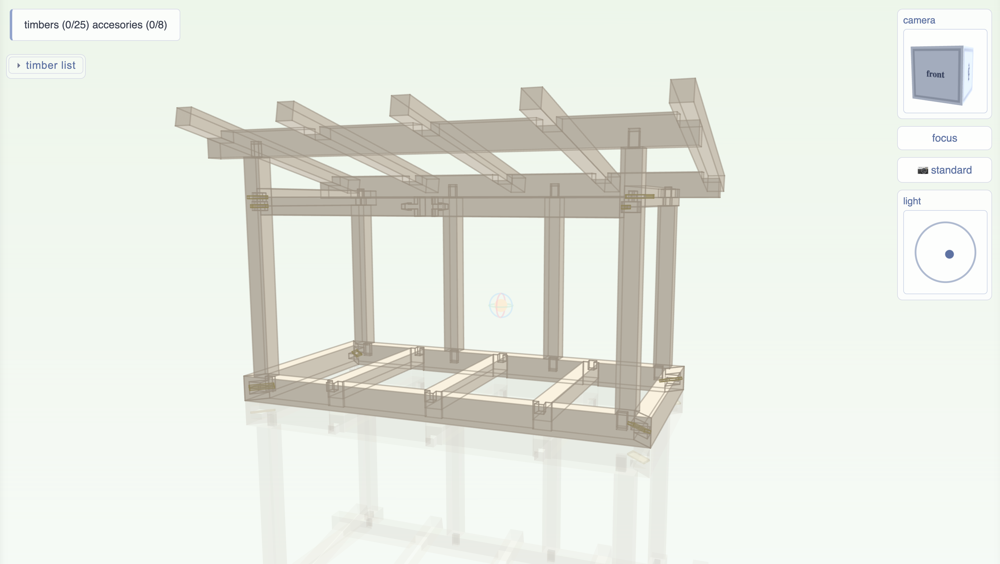

# Kumiki

Kumiki is a PROGRAMMATIC CAD library for timber framing and woodworking.

As a programmatic CAD tool, it is well suited for usage with AI agents 🤖

Kumiki is used together with Kigumi--a VSCode extension for viewing your kumiki designs!

Kumiki is in FREE and OPEN SOURCE (FOSS), try it out! There are many more features to come. 

Expect frequent breaking changes accompanied by a minor version bump. The AI agent should be able to easily address any breaking API changes based on the changelog.

## setup

Kumiki is best used with Kigumi. To install Kigumi, install [VSCode](https://code.visualstudio.com/) and install the [Kigumi](https://marketplace.visualstudio.com/items?itemName=minimaple.kigumi) extension.

I think Kigumi also requires [python3](https://www.python.org/downloads/), the rest of the dependencies get installed automagically for you.

You can of course use Kumiki without Kigumi. You can still use Kigumi to setup your Kumiki projects and its dependencies.

## your first kumiki project

Create a folder for your Kumiki project and open that folder in VSCode. Then click "Initialize Project" from the Kumiki menu. You may also run "kigumi: initialize project" command from the command pallete. This will create a placeholder my_cute_frame.py project file for you that you can build on! 

Open the Kigumi menu by clicking on the Kigumi extension icon in the left side bar.
You may also open Kigumi by opening the command palette in VScode (cmd/ctrl+shift+p). Start typing "kigumi" and choose the "View: Show Kigumi" command. 
You can open a Kumiki project file directly by choosing "Kigumi: Open Current File in Viewer" in the command pallete when that file is focused.

## viewing the built in patterns and examples

Kigumi ships with a patternbook and several examples. These can be explored through the kigumi menu. You can choose to "view source" or "duplicate in workspace" if you want to modify the patterns. 

## making changes

Kigumi designs are built with CODE. You can write this CODE yourself, or you can ask AI to write the CODE for you.

Kigumi installs with a set of AI agent instructions. The installed `kumiki` Python package includes the Kumiki library source files, built-in patterns, and the `docs/` content, so those resources are present in the Python environment used by Kigumi. Using human like prompting should serve you pretty well. Using carpentry or woodworknig terminology will serve you better. Please refer to the patternbook for the list of available joints. It's best to build your structure in increments previewing each step along the way but I won't stop you from asking your agent to "build me a house". You can implement your own joints as well. The AI agents currently struggle with this especially if you are unfamiliar with terminology and geometry conventions for prompting it, so don't expect much. Someday I'll have better prompting examples and skills to share here. Stay tuned.

To learn more about authoring Kumiki designs without AI, please start with [docs/concepts.md](docs/concepts.md) to learn more about Kumiki's design philosophy, and then proceed with the various example structures that ship with Kumiki.
Kumiki is very SIMPLE and VERBOSE by design. So it LOOKS complex but in actuality, it is quite simple to understand. A typical structure is built as follows:

- estabalish a footprint
- erect foundational timbers on the footprint
- join foundational timbers with additional timbers to complete the "shape" of the structure
- cut joints on timbers to properly connect the timbers completing the structure

Understanding Kumiki will also allow you to better instruct the agent to implement your designs! For example, instead of saying "I want my building to be an L shape" you might say "establish an L shaped footprint for the building". If you ever have questions, you can also just ask the agent to explain!

## Drawing Support

Drawing support (for making plans or per-member blueprints) is coming very soon!

For now, your best bet right now is to export as STEP or STL files and generate drawings in another software. Kumiki/Kigumi will add support for this in 3 stages:

1. ability to measure features relative to each other in Kigumi
2. ability to generate and export drawings inside kigumi

# Contributing

If you'd like to contribute new joints, you can always create a new file in kumiki/joints/community and add yourself as a CODEOWNER for that file. These joints may eventually be promoted to the main joint folder. 

If you'd like to contribute it's best to first contact me. There are plenty of joints and new features to work on :).

## Developing Kumiki

To setup for local development, just check out this repo and use `uv` to manage all your dependencies. The `Makefile` has convenient shortcuts for all your setup and testing needs.

Kigumi has a separate project scanning flow such that it can be used with the Kumiki repo itself as the workspace. Just use Kigumi like you normally would to test Kumiki.

## Developing Kigumi

Kigumi is 100% AI SLOP and it seems to not even be that awful :). Still, it's designed with more care than I might sometimes pretends. It may be best to open a bug report of feature request in github vs making a PR as I have no documented architectural guidance for kigumi yet simultaneously highly opinionated.

## Contributor License Agreement

Before your first pull request can be merged, you'll be asked to sign the [Contributor License Agreement](CLA.md) by posting a comment on the PR. The CLA bot tells you exactly what to write, and you only sign once.

# License

- **kumiki** (the Python library, its patterns and docs) is under the [Mozilla Public License 2.0](LICENSE).
- **kigumi** (the viewer: the VS Code extension and desktop app, in `kigumi/`) is under the [Elastic License 2.0](kigumi/LICENSE). You may use, modify and redistribute it freely, including commercially. What you may not do is offer it to others as a hosted or managed service -- the hosted web version of kigumi is published only by the project owner.

Releases of kigumi up to and including 0.7.2 were under MPL-2.0 and remain so. Third-party files bundled with kigumi, such as those in `kigumi/webview/vendor/`, keep their own licenses.
